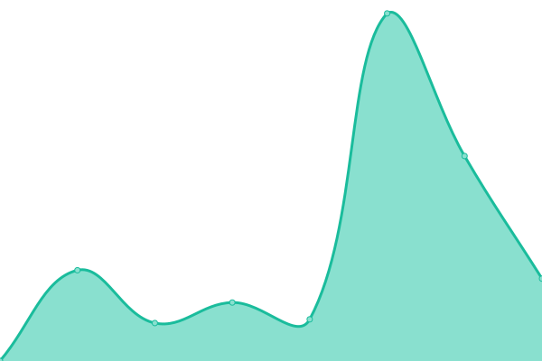

# [📈 Live Status](https://harleykin.github.io/dotnetuptime): <!--live status--> **🟩 All systems operational**

This repository contains the open-source uptime monitor and status page for [Nicki Faulk](http://www.nickifaulk.com/), powered by [Upptime](https://github.com/upptime/upptime).

With [Upptime](https://upptime.js.org), you can get your own unlimited and free uptime monitor and status page, powered entirely by a GitHub repository. We use [Issues](https://github.com/harleykin/dotnetuptime/issues) as incident reports, [Actions](https://github.com/harleykin/dotnetuptime/actions) as uptime monitors, and [Pages](https://harleykin.github.io/dotnetuptime) for the status page.

<!--start: status pages-->
<!-- This summary is generated by Upptime (https://github.com/upptime/upptime) -->
<!-- Do not edit this manually, your changes will be overwritten -->
<!-- prettier-ignore -->
| URL | Status | History | Response Time | Uptime |
| --- | ------ | ------- | ------------- | ------ |
|  [NickiFaulk.com](https://www.nickifaulk.com) | 🟩 Up | [nicki-faulk-com.yml](https://github.com/harleykin/dotnetuptime/commits/HEAD/history/nicki-faulk-com.yml) | 

 991ms
     
 | 

<a href="https://harleykin.github.io/dotnetuptime/history/nicki-faulk-com">98.99%</a>
    

|  [NowWereCookin.org](https://www.nowwerecookin.org) | 🟩 Up | [now-were-cookin-org.yml](https://github.com/harleykin/dotnetuptime/commits/HEAD/history/now-were-cookin-org.yml) | 

 1450ms
     
 | 

<a href="https://harleykin.github.io/dotnetuptime/history/now-were-cookin-org">99.42%</a>
    

|  [Borg Collection](https://fanlistings.nickifaulk.com) | 🟩 Up | [borg-collection.yml](https://github.com/harleykin/dotnetuptime/commits/HEAD/history/borg-collection.yml) | 

 505ms
     
 | 

<a href="https://harleykin.github.io/dotnetuptime/history/borg-collection">99.42%</a>
    

|  [WebRing Compendium](https://webrings.nickifaulk.com) | 🟩 Up | [web-ring-compendium.yml](https://github.com/harleykin/dotnetuptime/commits/HEAD/history/web-ring-compendium.yml) | 

 216ms
     
 | 

<a href="https://harleykin.github.io/dotnetuptime/history/web-ring-compendium">99.42%</a>
    

<!--end: status pages-->

[**Visit our status website →**](https://harleykin.github.io/dotnetuptime)

## 📄 License

- Powered by: [Upptime](https://github.com/upptime/upptime)
- Code: [MIT](./LICENSE) © [Nicki Faulk](http://www.nickifaulk.com/)
- Data in the `./history` directory: [Open Database License](https://opendatacommons.org/licenses/odbl/1-0/)
